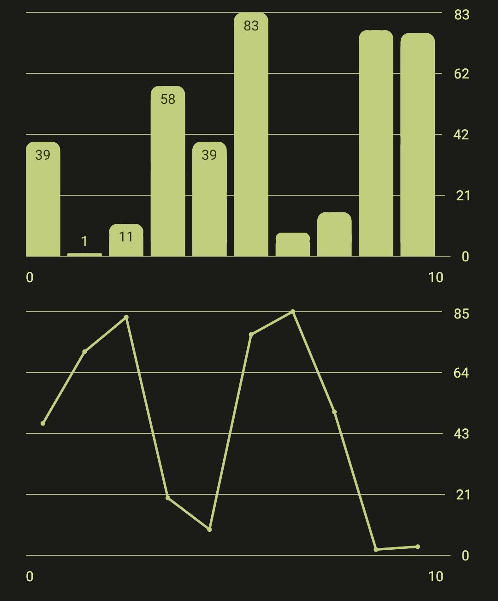
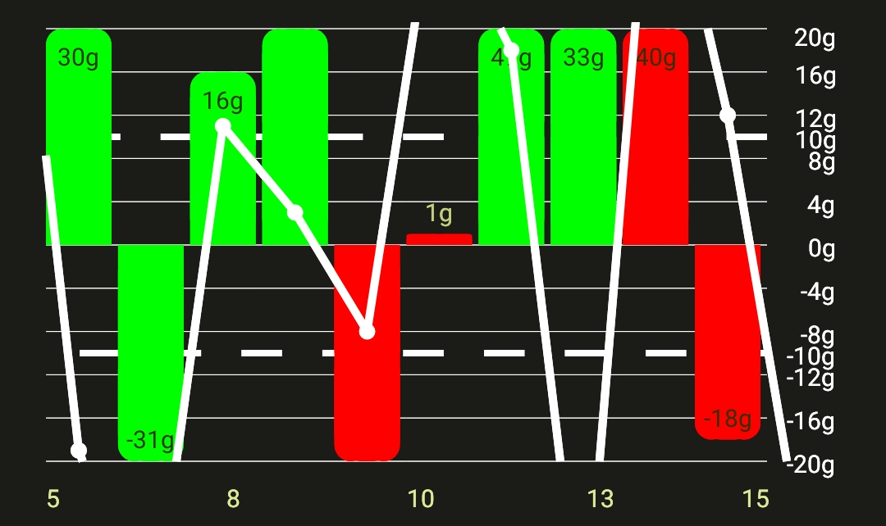
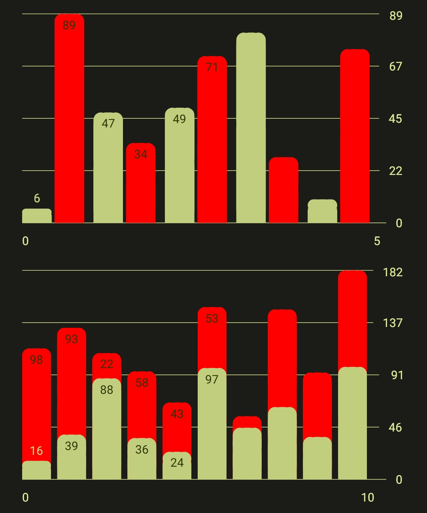
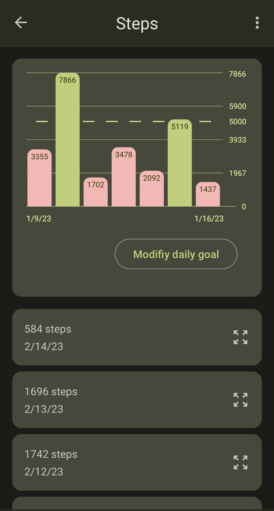

<p align="center">
  
</p>

# Dzeio Charts

Highly customizable and easy to use Chart library for android

## Install

- Add Jitpack.io to your `settings.gradle` file `maven { url 'https://jitpack.io' }`

Add to you dependencies (check the latest release for the version):
- (Gradle Kotlin DSL) Add `implementation("com.dzeio:charts:1.0.0")` 
- (Gradle Groovy DSL) Add `implementation "com.dzeio:charts:1.0.0" `

## Usage

_note: full featured examples in the `sample` app_

Add this to your views

```xml
<com.dzeio.charts.ChartView
    android:id="@+id/chart_line"
    android:layout_width="match_parent"
    android:layout_height="200dp" />
```


```kotlin
val chart = binding.chart // get the chart from the view
// setup the Serie
val serie = LineSerie(chart)

// give the serie its entries
serie.entries = // fill this with com.dzeio.charts.Entry
serie.entries = arrayListOf(
  Entry(
      1,
      53f
  )
)

// refresh the Chart
chart.refresh()
```

|               Basic charts                |           Fully customized chart            |           Grouped/Stacked charts            |
|:-----------------------------------------:|:-------------------------------------------:|:-------------------------------------------:|
|  |  |  |

<p align="center">
  <b>Example Usage</b>
</p>
<p align="center">in a health oriented step counter with a daily goal</p>
<p align="center">
  
</p>

_note: Every charts used above used a helper function to have Material 3 colors [See the MaterialUtils.kt class](sample/src/main/java/com/dzeio/chartsapp/utils/MaterialUtils.kt)_

## Build

- Install Android Studio
- Build the app
- it will be running on your emulator/device
- test it!

## Contributing

See [CONTRIBUTING.md](https://github.com/dzeiocom/charts/blob/master/CONTRIBUTING.md)

TL::DR

- Fork
- Commit your changes
- Pull Request on this Repository

## License

This project is licensed under the MIT License. A copy of the license is available at [LICENSE.md](https://github.com/dzeiocom/charts/blob/master/LICENSE.md)
